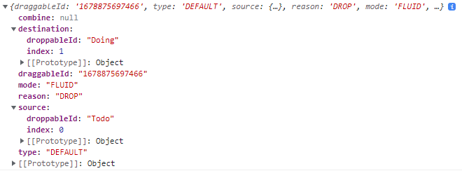

# Nomad_React-Beautiful_dnd

## Installation

```
$ npm install react-beautiful-dnd
$ npm i --save-dev @types/react-beautiful-dnd
$ npm install recoil-persist
```

## react-beautiful-dnd

### DragDropContext

- drag and drop 을 사용할 부분을 감싸줘야 함
- Provider 처럼 전체를 감싸는 것이 좋음

- onDragEnd
  - props 로, drag and drop 이 끝난 후의 기능을 담은 함수
  - 이때 파라미터로 이동한 정보를 제공
    

### Droppable

- drop 될 영역으로, props 로 droppableId 를 지정하여 해당 영역의 이름을 지정

- 기본 형태

  ```
  <Droppable droppableId={boardId}>
    {(magic, snapshot) => <DraggableCard />}
  </Droppable>
  ```

- Droppable 내부에 익명 함수의 첫번째 파라미터

  - innerRef : 최상단 노드에 지정해줘야 이동한 정보를 제공받을 수 있음
  - placeholder : 요소가 움직이느라 비어있을 때 크기가 변경되지 않도록 채워주는 기능

- Droppable 내부에 익명 함수의 두번째 파라미터

  - isDraggingOver : Droppable 영역 안의 요소가 이동할 때
  - draggingFromThisWith : Droppable 영역 안의 요소가 완전히 떠날 때
  - droppableProps : Droppable 요소에 적용해야하는 속성이 포함 된 개체로 innerRef를 적용한 동일한 요소에 적용해야 함. 현재 스타일링 및 조회에 사용하는 데이터 속성이 포함되어 있음

### Draggable

- 다른 Droppable 로 이동하는 영역이기 때문에 Droppable 내부에 있어야 하며 drag 가 가능한 영역으로, props 로 draggableId 와 index 를 지정.

- 이때 key 값을 준다면 key 값에 index 가 아닌 draggableId 에 넣은 값을 줘야 에러가 나지 않음

- Draggable 도 Droppable 과 동일한 구조로 내부에 익명 함수를 넣어 파라미터로 여러가지 기능을 받을 수 있다

- Draggable 내부에 익명 함수의 첫번째 파라미터

  - innerRef : Droppable 과 동일
  - draggableProps : 필수 작성
  - dragHandleProps : 특정 부분에만 마우스커서가 변경되며 드래그할 수 있음

- Draggable 내부에 익명 함수의 두번째 파라미터

  - isDragging : boolean 타입으로 drag 상태일 때 true.

## Code Challenge!

- todo 입력하는 input 스타일 변경
- todo 를 로컬 스토리지에 저장하기
- todo 삭제하기(버튼x, 화면에 쓰레기통 아이콘을 만들어 거기로 드롭하면 삭제되도록 만들기)
- 큰 board 를 추가하여 안의 board 를 드래그앤드롭해서 순서를 바꿔보기(board state 라는 atom 을 생성해서 모든 board 의 움직임 추적)
- input 을 추가해 엔터할 때마다 보드를 추가로 만들어보기
